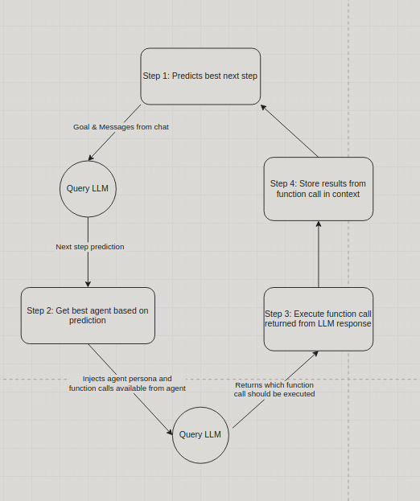
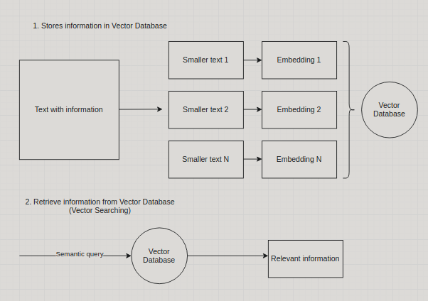

# Evo's architecture

## Overview

Evo is composed of a series of specialized agents, each adept at performing tasks within specific areas of expertise.

Initially, it engages with a large language model (LLM) to anticipate the subsequent action required, taking into consideration the objective and any prior exchanges.

Following this, Evo selects the appropriate agent for the task at hand. This selection is based on the agent's area of expertise and the range of function calls it can perform.

Once the appropriate agent is chosen, a second LLM interaction takes place to ascertain the precise function call needed to fulfill the requested goal. After executing the function call, the outcome is recorded in the chat. The cycle then repeats—continuously evaluating and acting—until Evo confirms the successful achievement of the goal or determines that it cannot be realized.

### Available Agents

| Agent                                                               | Description |
|---------------------------------------------------------------------|-------------|
| 🥷 [Evo](https://github.com/polywrap/evo.ninja/tree/dev/packages/agents/src/agents/Evo)                                                            | An assistant designed to achieve user goals. Predicts what the next step should be and find the best agent to execute the goal |
| #️⃣ [Csv Analyst](https://github.com/polywrap/evo.ninja/tree/dev/packages/agents/src/agents/CsvAnalyst)                                                    | An expert analyzing and modifying CSV datasets. |
| 💻 [Developer](https://github.com/polywrap/evo.ninja/tree/dev/packages/agents/src/agents/Developer)                                                      | A developer assistant that excels at coding related tasks with access to the file system. It plans and writes code to files. |
| 🌐 [Researcher](https://github.com/polywrap/evo.ninja/tree/dev/packages/agents/src/agents/Researcher)                                                     | Advanced web information retriever that allows to do complex research in the internet. |
| 📝[Synthesizer](https://github.com/polywrap/evo.ninja/tree/dev/packages/agents/src/agents/Synthesizer)                                                    | An assistant that handle files in workspace |

## Techniques used in Evo

### Vector Searching

Evo has its own implementation of Vector Database in order to be able do Vector Searching, allowing it
to add huge pieces of information into it and then doing a semantic query to get the needed information. The way it works is like the following:
1. All the information at hand is divided into smaller pieces of texts
2. The smaller pieces of text are converted to embeddings (which means they are converted to an array of numbers)
3. The information is stored locally in the form of embeddings
4. Given a query, the relevan information is extracted for the DB

Vector search is used in different parts of Evo, like the agent selection or chat contextualization

### Variables in function calls

Sometimes, executing function calls, the response of those might be longer than what the context window may supports; to fix this,
Evo manages lengthy function call responses by establishing new variables. When a response exceed the model's context window capacity due to its token count, Evo stores the response data in these variables, maintaining it distinct from the chat history to prevent context window overflow.

These variables allow for a condensed summary to be integrated into prompts for other functions as needed, ensuring the objective is met while retaining access to the complete data for more intricate tasks.

Responses compact enough to fit within the context window are handled directly, without the need for variable storage.

### Chat contextualization

Prior to initiating a function call and after determining the most suitable agent for the task, Evo contextualizes the chat. This involves selectively filtering the chat to provide only the relevant information that the chosen agent requires to accomplish the given goal. The aim is to prevent overloading the context window and to provide the agent with a more focused context for what it needs to consider.